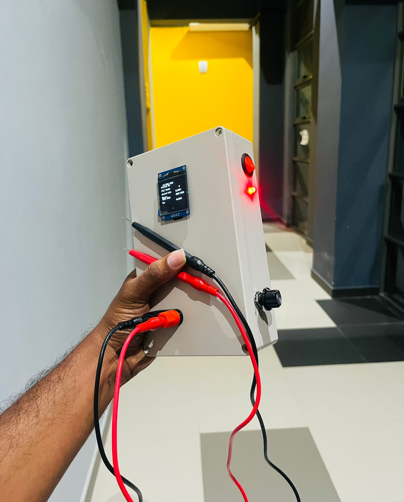
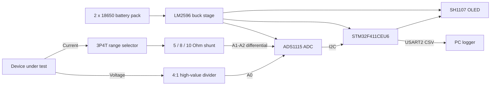
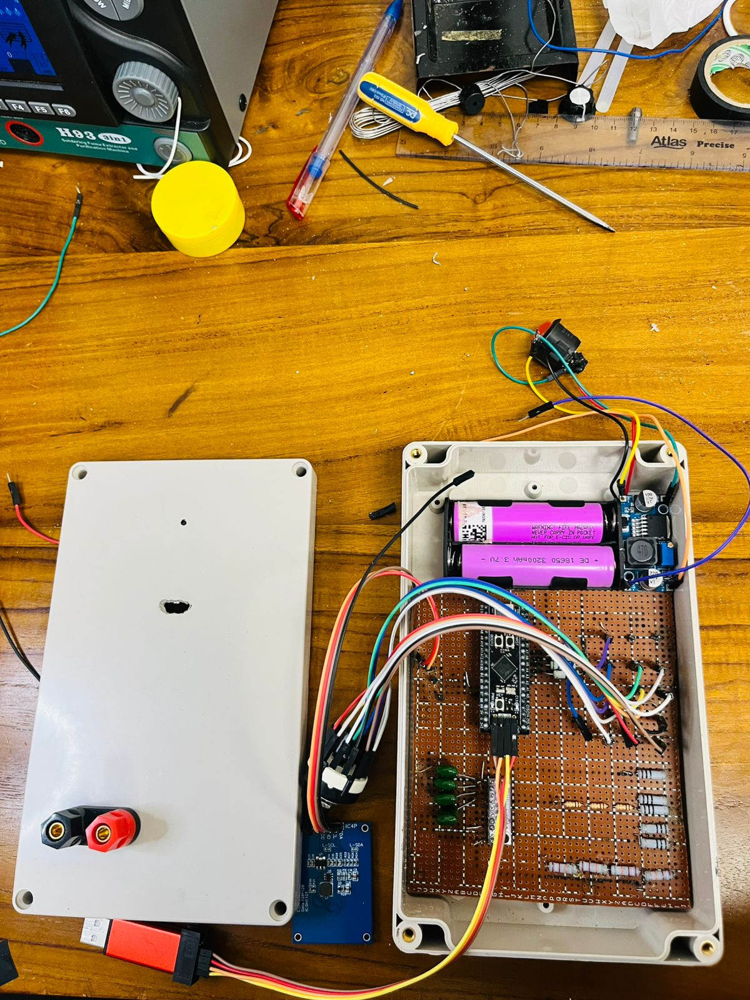

# STM32 Current & Voltage Measurement System

<p align="center">
  
</p>

<p align="center">
  A battery-powered academic measurement prototype built around the STM32F411 and ADS1115.
</p>

## Overview

This project explores low-loading DC voltage measurement and multi-range current sensing for embedded-system development. The prototype combines a high-value voltage divider, manually selected shunt resistors, a 16-bit external ADC, a local OLED interface, and UART output for PC-side logging.

The system was assembled on Vero board and installed in a portable enclosure. A custom two-layer PCB was also designed, but the documented final prototype used the Vero-board implementation because fabrication was not available within the project schedule.

> [!IMPORTANT]
> "Ultra-precision" is the original project title, not a metrology certification. The supplied report describes calibration results, but the raw firmware, calibration dataset, BOM, and native KiCad files have not yet been added to this repository.

## Project at a glance

| Area | Documented implementation |
|---|---|
| Controller | STM32F411CEU6 Blackpill |
| ADC | ADS1115, 16-bit delta-sigma ADC with PGA and I2C |
| Voltage path | 4:1 divider using four 22 kOhm resistors; target range up to 12 V DC |
| Current path | Three manually selected shunts: 5 Ohm, 8 Ohm, and 10 Ohm |
| Local UI | 128 x 128 SH1107 OLED |
| Data output | USART2, 115200 baud, CSV-style serial output |
| Power | Two 18650 Li-ion cells, master switch, and LM2596 buck stage |
| Construction | Vero-board prototype in a portable enclosure |

## Architecture



## Measurement approach

### Voltage

Four 22 kOhm resistors form an 88 kOhm divider. With the output taken across the bottom 22 kOhm resistor, the divider scales 12 V to approximately 3 V:

```text
VADC = VDUT x 22 kOhm / 88 kOhm = VDUT / 4
```

The maximum documented load at 12 V is approximately 136 microamps. A 0.1 microfarad capacitor at the ADC input provides low-pass filtering.

### Current

The current path uses Ohm's law and manual range selection:

```text
I = VSHUNT / RSHUNT
```

| Position | Shunt | Reported operating region | Expected shunt drop |
|---:|---:|---:|---:|
| 1 | 5 Ohm | 20-100 mA | 100-500 mV |
| 2 | 8 Ohm | 2-20 mA* | 16-160 mV |
| 3 | 10 Ohm | 1-200 microamps | 10 microvolts-2 mV |

\* One section of the report states 0.2-20 mA instead. Confirm the implemented boundary from the firmware and calibration data before treating this table as authoritative.

## Repository map

| Path | Contents | Status |
|---|---|---|
| [`docs/TECHNICAL_OVERVIEW.md`](docs/TECHNICAL_OVERVIEW.md) | Architecture, equations, interfaces, and source inconsistencies | Ready |
| [`docs/HARDWARE.md`](docs/HARDWARE.md) | Hardware implementation and design assets | Ready |
| [`docs/VALIDATION.md`](docs/VALIDATION.md) | Reported results and evidence still required | Ready |
| [`docs/PROJECT_HISTORY.md`](docs/PROJECT_HISTORY.md) | Design iterations, failures, and lessons learned | Ready |
| [`docs/source/`](docs/source/) | Original report and presentation | Included |
| [`firmware/`](firmware/) | STM32CubeIDE/CubeMX project contribution area | Awaiting team upload |
| [`hardware/kicad/`](hardware/kicad/) | Native schematic and PCB source contribution area | Awaiting team upload |
| [`hardware/bom/`](hardware/bom/) | Bill of materials contribution area | Awaiting team upload |
| [`tests/`](tests/) | Calibration data, test scripts, and captured results | Awaiting team upload |

## Prototype gallery

| Enclosure | Internal assembly |
|---|---|
|  |  |

More build photos and engineering exports are available in [`docs/assets/`](docs/assets/).

## Current project status

- The physical prototype and enclosure are documented with original photographs.
- A schematic export and PCB-layout export are included.
- The report describes working OLED output and UART logging.
- The report describes failed op-amp, ESP8266/WebSocket, and SD-card approaches; these are retained as engineering history rather than advertised as working features.
- Firmware, native EDA sources, reproducible calibration data, and a finalized BOM still need to be contributed by the team.

## Contributing

Team members should create their own branch, commit their own artifacts, and open a pull request. This preserves authorship and makes review straightforward. See [`CONTRIBUTING.md`](CONTRIBUTING.md) for the exact workflow and directory ownership guidance.

## Team

The contribution table is intentionally left for the team to complete from actual work and Git history.

| Member | GitHub | Primary contribution |
|---|---|---|
| To be added | `@username` | Repository coordination / integration |
| To be added | `@username` | Hardware design |
| To be added | `@username` | Firmware / validation |

## Safety

This is a low-voltage educational prototype, not a certified multimeter. Do not connect it to mains voltage, high-energy sources, or circuits outside the documented DC range. Confirm polarity and range selection before making a current measurement, and follow safe Li-ion charging and handling practices.

## License

No open-source license has been selected yet. Until the project team agrees on one, the repository contents remain under their existing copyright.

