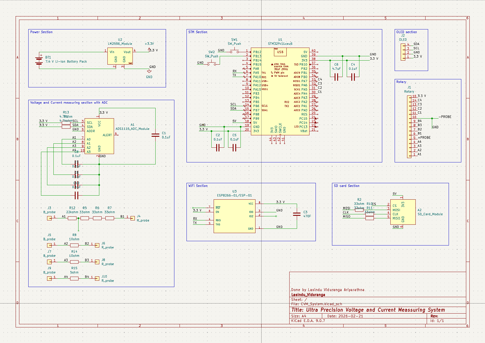
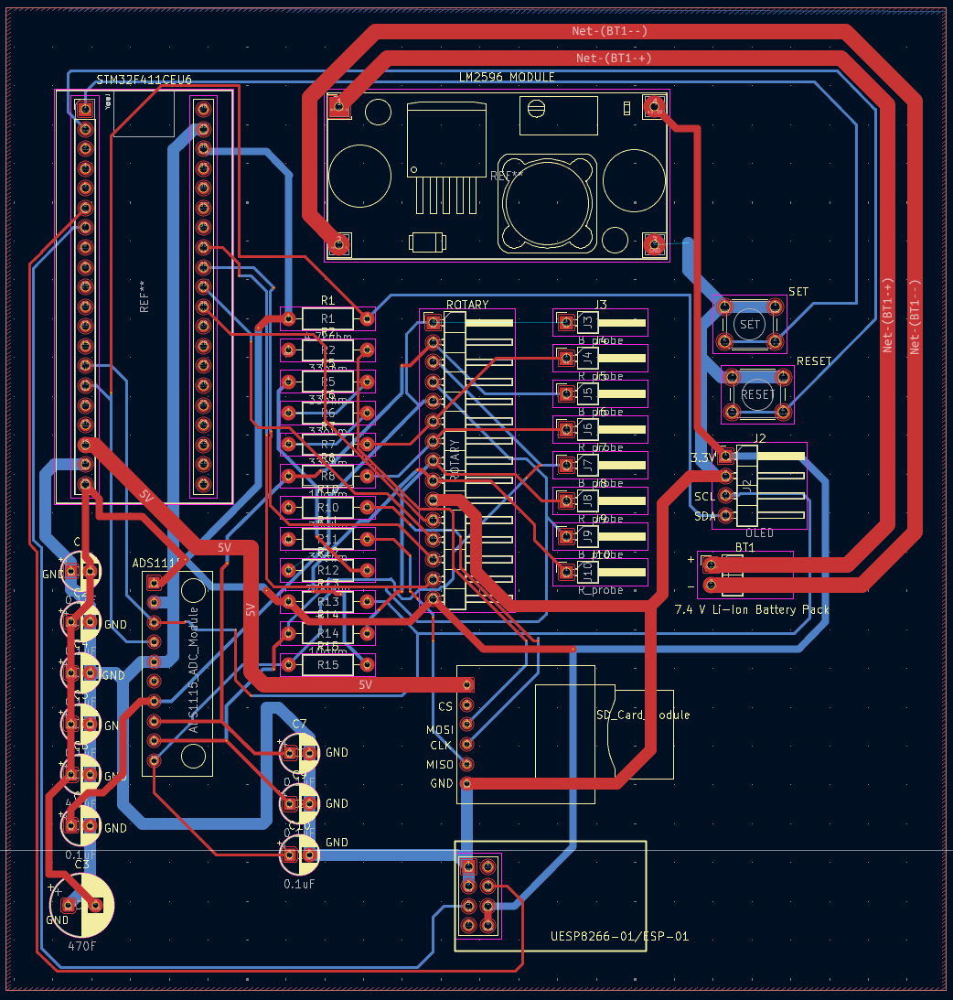

# Hardware

## Implemented prototype

The final documented prototype uses a Vero-board assembly inside a portable plastic enclosure. The front panel contains the OLED, master power switch, status indicator, range selector, and measurement terminals.

## Major components

| Component | Documented part | Role |
|---|---|---|
| Microcontroller | STM32F411CEU6 Blackpill | Acquisition, scaling, display, and communication |
| ADC | ADS1115 | Single-ended voltage and differential shunt conversion |
| Display | SH1107 128 x 128 OLED | Local measurement display |
| Range selector | 3P4T rotary switch | Manual current-range selection |
| Shunts | 5 Ohm, 8 Ohm, 10 Ohm | Current-to-voltage conversion |
| Divider | Four 22 kOhm resistors | 4:1 voltage scaling |
| Input filtering | 0.1 microfarad ceramic capacitors | ADC input-noise reduction |
| Power stage | LM2596 module | Battery-rail regulation |
| Battery pack | Two 3.7 V 18650 cells in series | Portable supply |

## Schematic export

The supplied report contains the following schematic image. It includes optional ESP8266 and SD-card sections that the report identifies as unsuccessful experiments, not confirmed features of the working prototype.

## PCB design

A two-layer PCB was laid out to consolidate the measurement, display, power, Wi-Fi, and SD-card sections. Fabrication was not completed within the semester-project timeline, so the physical prototype remained on Vero board.

The native KiCad project was not included in the supplied files. Add it to [`../hardware/kicad/`](../hardware/kicad/) so the design can be checked and reproduced.

## Before building another unit

1. Verify the OLED interface and pin mapping against the actual firmware.
2. Verify the LM2596 output and every downstream rail.
3. Confirm rotary-switch pole/throw continuity before connecting the DUT.
4. Recalculate shunt dissipation and burden voltage for every intended range.
5. Add battery protection and an appropriate Li-ion charging strategy.
6. Review grounding, ADC common-mode limits, input protection, and connector polarity.
7. Validate the full design on current-limited bench supplies before installing batteries.
